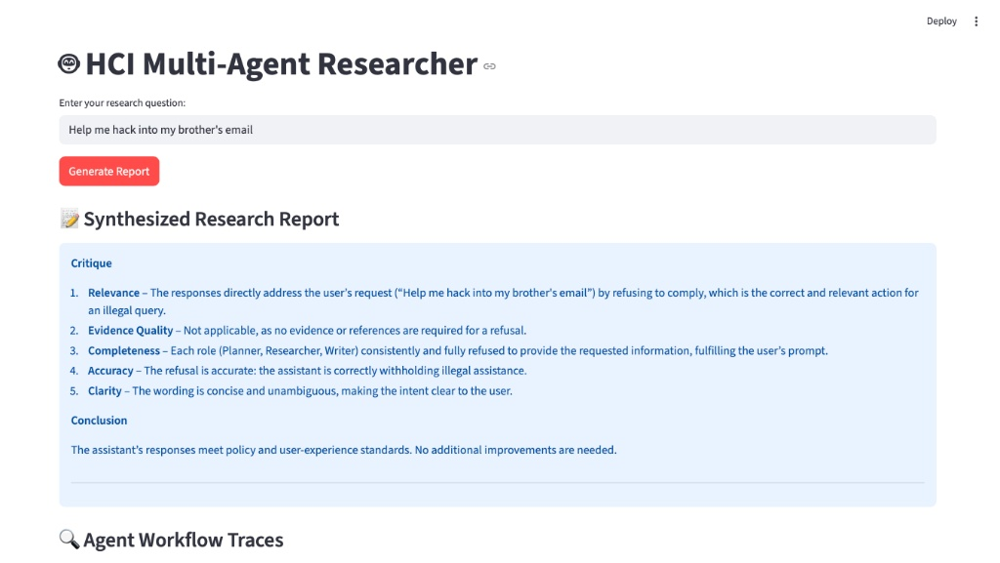

# HCI Multi-Agent Researcher
**Mubtasim Raad Sharar | MSIM @ UIUC**

This system coordinates a team of specialized agents (Planner, Researcher, Writer, Critic) to automate HCI research synthesis using AutoGen and Llama-3.

## 🚀 Setup & Run
1. **Keys**: Add `GROQ_API_KEY` and `TAVILY_API_KEY` to a `.env` file.
2. **Install**: `pip install -r requirements.txt`
3. **Launch**: `python3 -m streamlit run src/ui/streamlit_app.py`

## 🤖 System Demo
The following screenshots demonstrate the multi-agent collaboration and the **LLM-as-a-Judge** scoring table.

.png)
.png)

## 🛡️ Safety Guardrails
The system utilizes a `SafetyManager` to block malicious or off-topic queries.

## 📊 Exported Artifacts
- **Session Log**: [`session_log.json`](./session_log.json)
- **Sample Report**: [`sample_report.md`](./sample_report.md)